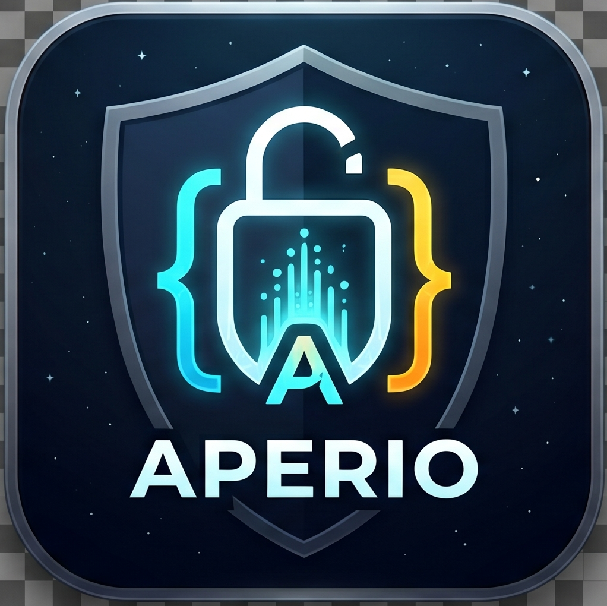

<p align="center">
  
</p>

<h1 align="center">Aperio</h1>

<p align="center">
  <strong>A local-first API workspace for developers who want speed, privacy, and spec-native workflows — without a cloud account.</strong>
</p>

<p align="center">
  Built with <a href="https://v2.tauri.app/">Tauri v2</a>, <a href="https://react.dev/">React</a>, and <a href="https://www.rust-lang.org/">Rust</a> — small binaries, low memory use, your data stays on disk.
</p>

<p align="center">
  <a href="#features">Features</a> ·
  <a href="#quick-start">Quick Start</a> ·
  <a href="#workspace-import">Workspace Hub</a> ·
  <a href="#cli-usage">CLI</a> ·
  <a href="#architecture--diagrams">Architecture</a> ·
  <a href="#production-builds">Production Builds</a> ·
  <a href="#testing">Testing</a> ·
  <a href="#releases">Releases</a>
</p>

---

## Features

Aperio is a **universal API workspace hub**: import a spec once, browse endpoints in the sidebar, pre-fill requests, send them via a Rust HTTP core, and keep history encrypted locally.

**Postman migration, locally.** Aperio is a full-featured, **local-first alternative to Postman** for day-to-day API work: export a **Postman Collection v2.1** (`.json`) from Postman and import it natively — no cloud sync, no account lock-in. Folder structure, methods, URLs, headers, query parameters, and raw bodies are preserved and land in the request builder exactly like OpenAPI workspaces.

### Supported formats

| Format | Source | What you get |
|--------|--------|----------------|
| **OpenAPI 3.x** | `.yaml`, `.yml`, `.json` or URL | Collapsible endpoint tree, JSON body skeletons for POST/PUT/PATCH, path & query parameter metadata |
| **Serverless Framework** | `serverless.yml` / `.yaml` | HTTP and HTTP API events → methods & paths; project title from `service:` |
| **Postman Collection v2.1** | `.json` (export from Postman) | Folder-aware endpoint names, pre-filled headers & bodies, query params — **local Postman replacement** |

Rust **auto-detects** the format (`info._postman_id`, `info.schema`, `service` + `functions`, or `openapi` key) when you import a file. All formats normalize into the same **Projektraum** (workspace) structure — identical sidebar and builder behaviour regardless of origin.

### Core capabilities

- **Local-first & Git-friendly** — No mandatory cloud sign-in. Request history, environments, and encrypted tokens live in a local SQLite database. Spec files remain plain text you can version in Git.
- **Encrypted token vault** — Per-workspace API tokens use **AES-256-GCM**; the master key lives in the OS keychain (macOS Keychain, Windows Credential Manager).
- **Powerful cURL import** — Paste cURL from Chrome DevTools, Postman, or the terminal; a Rust parser fills method, URL, headers, and body.
- **Code snippet export** — Copy as **cURL** or **wget**, or generate **Go** (`net/http`) and **Rust** (`reqwest`) snippets.
- **Environments** — Named variable sets with `{{variable}}` substitution in URL, headers, and body; cyan placeholder highlighting in the builder.
- **Data hygiene** — Remove API tokens, environments, and builder table rows inline; reset the full local database via workspace backup import (see below).
- **Developer UX** — Three-column dark UI (sidebar · builder · response), DE/EN i18n, JSON response tree, request history restore, Playwright E2E in CI.

## Quick Start

### Prerequisites

- [Node.js](https://nodejs.org/) **20+**
- [Rust](https://rustup.rs/) **1.88+**
- [Tauri v2 prerequisites](https://v2.tauri.app/start/prerequisites/) for your OS

### Clone and run in development

```bash
git clone https://github.com/codeisconquer/Aperio.git
cd Aperio

npm install
npm run tauri dev
```

The app opens with the Vite dev server on `http://localhost:1420` and hot-reload for the React UI.

## Workspace import

Use **Import workspace** in the sidebar (Projekträume):

1. **From file** — Native dialog with filters for OpenAPI, Serverless (`serverless.yml`), and Postman Collection (`.json`). Rust auto-detects the format from filename and content.
2. **From URL** — Fetch OpenAPI 3.x JSON or YAML over HTTPS (e.g. Petstore). Serverless and Postman are file-only.

Imported workspaces appear as **collapsible folders** with method badges. Selecting an endpoint fills the request builder (URL, query params, headers, body — including full Postman pre-fill from imported collections).

**Postman workflow:** In Postman → Collection → **Export** → Collection v2.1 → in Aperio → **Import workspace** → choose the `.json` file (filter: *Postman Collection (*.json)*).

## CLI usage

Pass a spec path at startup; Rust parses it and opens the workspace via the `cli-import` event.

**Development:**

```bash
npm run tauri dev -- ./serverless.yml
npm run tauri dev -- ./openapi.yaml
npm run tauri dev -- ./collection.postman.json
```

**Release build (examples):**

```bash
# macOS
open -a Aperio --args ./api.yaml

# Linux / Windows (when on PATH)
aperio ./api.yaml
```

Supported at launch: **OpenAPI 3.x**, **Serverless YAML**, **Postman Collection v2.1** (same detection as file import).

## Managing local data

### Imported project workspaces (session)

Projekträume from file/URL import are held in **React state** for the current app session. They are not written to SQLite. To clear them, restart the app or start a fresh session.

### Request history (SQLite)

Every sent request is logged to the `history` table (last 50 shown in the sidebar). Restore any entry with one click.

There is no per-entry history delete in the UI yet; to wipe history (and tokens/environments) in one step, use **workspace backup import** below.

### API tokens

Open the lock icon on a workspace → **Token vault** → paste token → **Save**. Use **Remove** to delete the encrypted token for that project from SQLite.

### Environments

Create or edit environments from the sidebar dropdown. **Delete** removes an environment and its variables from SQLite.

### Workspace backup (export / import)

In the sidebar footer under **Workspace**:

| Action | Effect |
|--------|--------|
| **Export workspace** | Saves a copy of `aperio.db` (history, `secure_tokens`, `environments`) to a `.db` file you choose. |
| **Restore workspace backup** | **Replaces** the live database with the selected backup file. Use this to migrate machines or reset all persisted data. |

> **Warning:** Import overwrites your current local database. Export first if you need a safety copy.

## Architecture & diagrams

High-level docs for contributors:

| Document | Description |
|----------|-------------|
| [VISION.md](VISION.md) | Product vision and design tokens |
| [CONTEXT.md](CONTEXT.md) | Tech stack, IPC commands, import pipelines, testing |
| [SPRINTS.md](SPRINTS.md) | Delivery history (Sprints 1–18) |
| [docs/diagrams/](docs/diagrams/) | PlantUML process diagrams (render with [PlantUML](https://plantuml.com/) or the VS Code extension) |

### PlantUML diagrams (`docs/diagrams/`)

| File | Type | Describes |
|------|------|-----------|
| [`request_flow.puml`](docs/diagrams/request_flow.puml) | Sequence | React → Tauri IPC → `send_request` → `reqwest` → async SQLite history (`spawn_blocking`) → response UI |
| [`import_process.puml`](docs/diagrams/import_process.puml) | Activity | File/URL → format detection (OpenAPI / Serverless / Postman) → unified `SwaggerProject` → sidebar state |
| [`secure_token_vault.puml`](docs/diagrams/secure_token_vault.puml) | Sequence | UI token → OS keyring master key → AES-GCM + nonce → `secure_tokens` in SQLite |

Preview locally:

```bash
# requires PlantUML CLI
plantuml docs/diagrams/*.puml
# → PNG/SVG next to each .puml file
```

## Production builds

Frontend: `npm run build` · Native bundles: `npm run tauri build`

### macOS

```bash
npm install
npm run tauri build
# or
chmod +x build-mac.sh && ./build-mac.sh
```

Artifacts (version from `src-tauri/tauri.conf.json`):

- `src-tauri/target/release/bundle/dmg/Aperio_*_aarch64.dmg`
- `src-tauri/target/release/bundle/macos/Aperio.app`

Intel build:

```bash
rustup target add x86_64-apple-darwin
npm run tauri build -- --target x86_64-apple-darwin
```

### Windows

```powershell
npm install
npm run tauri build
```

Artifacts: `.msi` / NSIS `.exe` under `src-tauri\target\release\bundle\`

### Linux

```bash
sudo apt install -y libwebkit2gtk-4.1-dev libappindicator3-dev librsvg2-dev patchelf
npm run tauri build
```

Artifacts: `.AppImage`, `.deb` under `src-tauri/target/release/bundle/`

## Testing

```bash
npm test              # Vitest + React Testing Library
npm run test:e2e      # Playwright (Vite + Tauri IPC mock)
cd src-tauri && cargo test
```

CI runs these on every push/PR to `main` (`.github/workflows/ci.yml`).

## Releases

Version tags trigger multi-platform builds and GitHub Release assets:

```bash
# Align version in package.json and src-tauri/tauri.conf.json first
git tag v0.1.2
git push origin v0.1.2
```

The [Release workflow](.github/workflows/release.yml) attaches `.dmg`, `.msi`/`.exe`, and `.AppImage`/`.deb` to the release page.

See [CHANGELOG.md](CHANGELOG.md) for version history.

## Tech stack

| Layer | Technology |
|-------|------------|
| UI | React 19, TypeScript, Tailwind CSS 4, i18next |
| Shell | Tauri v2 |
| Core | Rust — `reqwest`, `rusqlite`, `openapiv3`, `serde_yaml`, AES-GCM, `keyring` |
| E2E | Playwright |

## License

License terms are defined in this repository. If no `LICENSE` file is present, all rights reserved unless stated otherwise by the maintainers.
